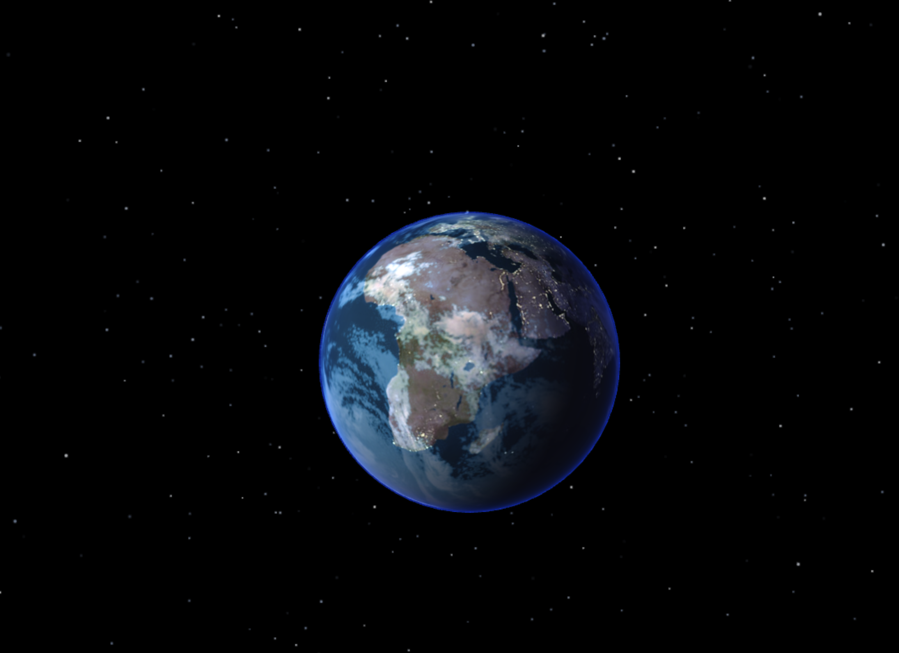

# THREE.js Earth Scene

This project creates a 3D Earth scene using THREE.js, a JavaScript 3D library. The Earth is textured using high-resolution maps, and various visual enhancements such as clouds and atmosphere effects are added to create a realistic representation.

## Features

- **3D Earth Model:** A detailed 3D model of the Earth with high-resolution textures.
- **Texture Maps:** Includes color, bump, specular, and clouds texture maps.
- **Orbit Controls:** Allows user to interact with the Earth by rotating and zooming.
- **Atmospheric Glow:** Simulates the glow of the atmosphere around the Earth.
- **Starfield Background:** A starry background to give a sense of space.
- **Real-time Rendering:** The Earth rotates smoothly and realistically.

## Earth Texture Maps

The texture maps used in this project can be found at [PlanetPixelEmporium](https://planetpixelemporium.com/earth.html). The following maps are included:

- Color Map: `00_earthmap1k.jpg`
- Bump Map: `01_earthbump1k.jpg`
- Specular Map: `02_earthspec1k.jpg`
- Night Lights Map: `03_earthlights1k.jpg`
- Cloud Map: `04_earthcloudmap.jpg`
- Transparent Cloud Map: `05_earthcloudmaptrans.jpg`

## Example

Here is an example of the Earth scene:



## Project Structure

```
threejs-earth/
├── node_modules/
├── src/
│   ├── getFresnelMat.js
│   ├── getStarfield.js
├── textures/
│   ├── stars/
│   │   ├── circle.png
│   ├── 00_earthmap1k.jpg
│   ├── 01_earthbump1k.jpg
│   ├── 02_earthspec1k.jpg
│   ├── 03_earthlights1k.jpg
│   ├── 04_earthcloudmap.jpg
│   ├── 05_earthcloudmaptrans.jpg
├── index.html
├── index.js
├── package.json
├── package-lock.json
└── README.md
```

## Getting Started

### Prerequisites

- Node.js and npm (Node Package Manager) installed on your machine.
- Live Server extension in Visual Studio Code for local development.

### Installation

1. Clone the repository:

   ```bash
   git clone https://github.com/Izaacapp/threejs-earth.git
   cd threejs-earth
   ```

2. Install the necessary dependencies:

   ```bash
   npm install
   ```

### Installing Live Server Extension

1. Open Visual Studio Code.
2. Go to the Extensions view by clicking on the Extensions icon in the Activity Bar on the side of the window or by pressing `Ctrl+Shift+X` (`Cmd+Shift+X` on macOS).
3. In the Extensions view search bar, type "Live Server" and press `Enter`.
4. Click on the "Live Server" extension from the search results and then click the "Install" button.

### Running the Project

1. Open the project in Visual Studio Code.
2. Open the `index.html` file.
3. Right-click on the `index.html` file and select "Open with Live Server". This will start the Live Server and open your project in your default web browser.
4. Navigate to `http://localhost:5500` (default port) to see the Earth scene.

## Usage

- **Rotate Earth:** Click and drag to rotate the Earth.
- **Zoom In/Out:** Scroll the mouse wheel to zoom in and out.

## Contributing

If you would like to contribute, please fork the repository and use a feature branch. Pull requests are welcome.

## License

This project is licensed under the MIT License. See the LICENSE file for details.

## Acknowledgments

- [THREE.js](https://threejs.org/) - JavaScript 3D Library
- [PlanetPixelEmporium](https://planetpixelemporium.com/earth.html) - Earth Texture Maps

